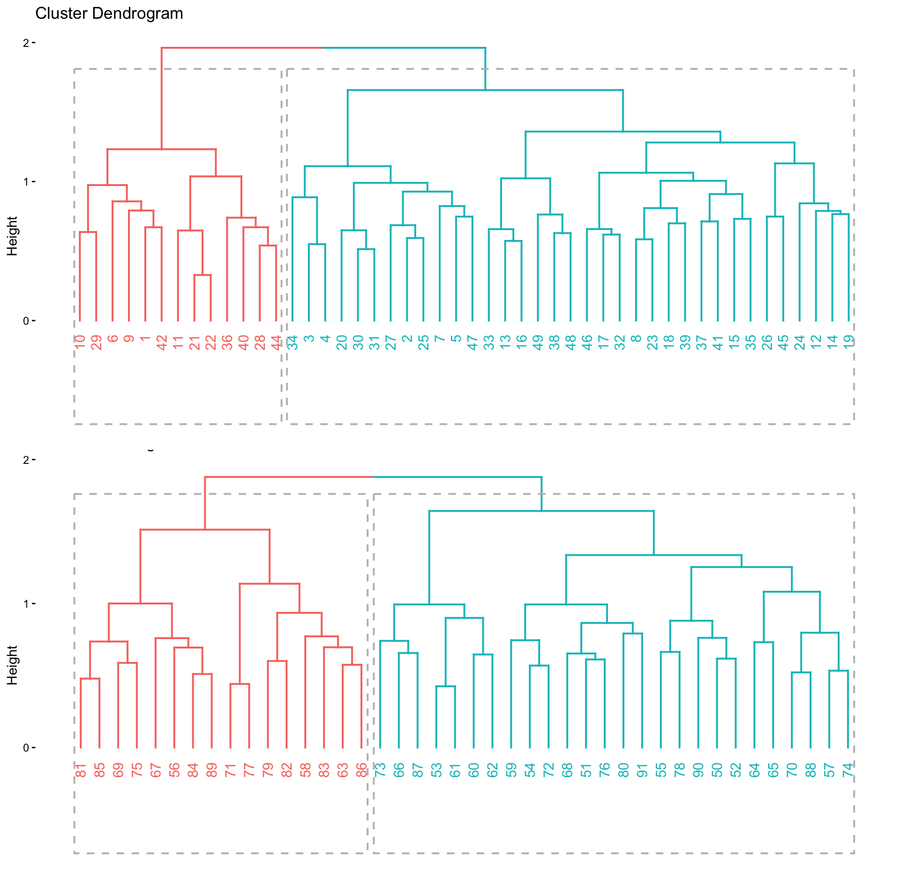
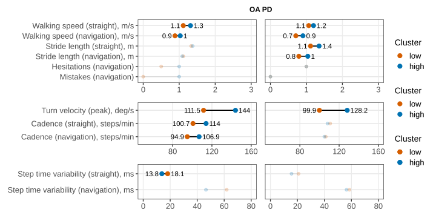

# Abstract

**Background**
Complex walking tasks such as turning while walking and performing cognitive tasks while walking are a common part of everyday life that amplify cognitive-motor impairments in +PD. Both turning and dual-tasking are suggested to utilize executive-attentional resources, connected to the prefrontal cortex, but how the prefrontal cortex and executive-attentional resources relate to levels of performance is not clear. Additionally, people utilize a range of turning strategies and individual priorities during dual-tasking, further complicating the relationship. This study aims to determine clusters of behavioral performance during navigated walking with and without a dual-task in +OA and people with +PD and characterize these clusters with +fNIRS-based neural correlates as well as clinical and demographic correlates.

**Methods**
Data from 48 +OA and 42 people with +PD performing a navigated walking task with and without an auditory Stroop task were analyzed. Behavioral data during navigation consisted of spatiotemporal gait and turning variables, reaction time and accuracy to the Stroop task, as well as accuracy of the navigation task. Prefrontal cortex activity was assessed with +fNIRS and executive-attentional resources determined with a neuropsychological test battery. Clinical data was collected via balance tests and questionnaires. Data analyses involved hierarchical clustering utilizing behavioral variables, and +fNIRS, clinical, neuropsychological and demographic data was compared between the clusters.

**Results**
Behavioral clustering formed two clusters for each group, one generally low-performing cluster and one generally high-performing cluster. Age and physical activity was a primary factor differentiating the clusters with the average age of the high performing cluster being around 67 years for +OA and people with +PD, and the average age of the low performing cluster being around 73 years for +OA and 75 years for people with +PD. Low-performing clusters scored worse on clinical and neuropsychological tests. Only the high performing clusters had a consistent increase of +dlPFC activity during navigation tasks.

**Conclusions**
Performance of navigated walking was not connected to a specific domain but instead showed to have a more global decline connected to age in both +OA and +PD. The global decline was associated with lower levels of prefrontal activity, perhaps due to limits of compensatory mechanisms.

# Introduction

Complex walking tasks such as turning while walking and performing cognitive tasks while walking are a common part of everyday life that amplify cognitive-motor impairments in +PD. As many as 45% of steps taken during daily walking are turning steps [@glaister2007], and studies have found that dual-task walking [@hillel2019; @yamada2020] resembles everyday walking more than walking assessments focusing only on usual straight walking. Therefore, complex walking in everyday life could create an issue for many people with +PD, since both turning and dual-tasking are triggers for freezing of gait [@spildooren2019; @spildooren2010], and are also highly associated with falls in +PD [@michalowska2005]. Moreover, there is a link between fall risk and impaired dual-task ability in +OA [@muir-hunter2016]. A lower turn quality has also been linked to an increase in falls in +OA [@leach2018].

While certain deficits in both turning and dual-task ability are known in aging and +PD, it is largely unknown what drives the performance of navigated walking, which limits our mechanistic understanding and ability to target this ability in interventions. Some studies have linked turning speed to overall gait speed [@weston2024], but other studies [@leach2018] have only looked at behavioral variables. Other studies have found that turning in +PD is affected by cognitive load [@spildooren2010], suggesting executive-attentional resources play a role. These resources are also crucial during dual-tasking [@yogev-seligmann2008]. These resources are strongly tied to the prefrontal area of the brain [@diamond2013], and in particular the +dlPFC and the cingulate cortex [@yogev-seligmann2008].

Defining good performance during walking and turning might not be straightforward. While studies have looked at turn angle and turn duration [@leach2018] as quality markers, people have different turning strategies [@nakamura2025] and priorities during dual-tasking [@maclean2017]. Perhaps someone walks fast but turns slow, or turns fast but does not prioritize a simultaneous cognitive task. One approach to determining types of performance is data-driven clustering such as k-means or hierarchical clustering [@hummel2024]. With many types of data on performance, clustering could reveal patterns of performance.

Thus, the aim of this study is to characterize navigated walking performance with and without a dual-task in +OA and people with +PD, and further to determine clusters of behavioral performance during navigated walking and characterize these clusters using +fNIRS-based neural correlates as well as clinical and demographic correlates.

# Methods

## Participants 

This study uses data from the "ParkMOVE" dataset, collected between 2021 and 2023 [@franzen2023]. Data from two groups were used: +OA and people with +PD. The data in the dataset were collected during experiments conducted across two sessions at the uMOVE core facility, Karolinska University Hospital, Solna, Stockholm. Exclusion criteria included speech difficulties, severe visual impairments, severe hearing problems, severe freezing of gait, or other neurological diseases or conditions affecting gait and balance.

## Experimental procedure

The experimental sessions included clinical tests of disease severity, balance, a neuropsychological test battery, along with prefrontal +fNIRS measurement during a block-based complex walking protocol. Participants performed the +fNIRS measurement during one first session, and clinical tests and neuropsychological tests during another with approximately one week between the sessions.

The +MDSUPDRS [@goetz2008] was used to assess disease severity for the +PD group. To assess balance, the +MiniBESTest [@dicarlo2016] was used. The neuropsychological test battery included tests from the +DKEFS [@delis2001]: the +TMT part II and IV to assess psychomotor speed and task-set-shifting, the +CWIT part III to assess inhibitory control, and Verbal Fluency parts I-III to assess verbal fluency and set-shifting. The +RAVLT [@schmidt1996a] was also performed to assess verbal learning and episodic memory.

Data from two sub-protocols (*navigation protocol* and *dual-task navigation protocol*) of the full walking protocol (fully described in [@franzen2023]) were used. The *navigation protocol* contained blocks of straight walking and navigated walking. The *dual-task navigation protocol* contained blocks of navigated walking and navigation while performing an auditory Stroop task. Block length was 20s, followed by 15-20s of rest period (standing still) as baseline. 6 blocks were repeated of each walking condition. Briefly, the straight walking task consisted of walking at a self-selected comfortable speed back and forth between two cones placed approximately 30m apart. The navigation task consisted of walking between colored cones placed in a pre-determined pattern, requiring the participant to walk and turn in both directions. The dual-task navigation combined the navigation task with an auditory Stroop [@morgan1989] task, delivered and recorded via wireless headphones.

Gait parameters and turning parameters were collected with three wireless inertial sensors (Opal, APDM Inc.) placed over the lumbar and on the feet. Raw data in each block was analyzed in the Python Gaitmap library [@kuderle2024]. To characterize turning, peak turn velocity was extracted from Mobility Lab (APDM Inc.).

+fNIRS data was collected using a NIRSport2 (NIRx), with an 8x8 montage covering the prefrontal area, including short-separation channels. Sampling frequency was 10 Hz.

## Hierarchical clustering

Behavioral data (spatiotemporal gait variables, turning variables, navigation task accuracy and auditory Stroop reaction time) were used to create clusters in each group (+OA and people with +PD). Clustering was performed using hierarchical clustering on a distance matrix generated via unsupervised Random Forest, which has several advantages such as accounting for linear and nonlinear variable interactions [@shi2006].

Before clustering, missing variables were imputed with random forest regression using the 'missForest' package (v1.6.1) in R (v4.5.2) [@rcoreteam2022]. For clustering, sample proximities were obtained from unsupervised random forest with 20 000 trees and converted into distances (1 - proximity) using the 'randomForest' package (v4.7.1.2) [@liaw2002]. Then, hierarchical clustering was performed on distances using the 'hclust' function with method 'Ward.D2'. The resulting dendrogram was then cut into _k_ clusters, with _k_ being obtained as the optimal number of clusters via majority vote of 30 different quality indices via the 'NbClust' (v3.0.1) package. Feature importance was estimated by training a supervised random forest with inferred cluster labels.

Cluster stability was assessed using the clusterboot function from the 'fpc' package (v2.2.14) [@hennig2026], producing Jaccard similarity values via bootstrap resampling. Number of resampling runs was set to 100. Stability was evaluated using Jaccard similarity guidelines: values above 0.75 were considered valid and stable clusters, values between 0.6 and 0.75 as indicating patterns in the data, and values below 0.6 as not valid clusters [@hennig2007].

## fNIRS analysis

+fNIRS data were analyzed in the MATLAB-based NIRS AnalyzIR toolbox [@santosa2018]. First, raw optical density data were converted into +HbO2 and +HbR using the modified Beer-Lambert law [@delpy1988]. The +DPF was set to depend on age [@scholkmann2013b]. Then, analyses used a combined form of +HbO2 and +HbR by calculating the +CBSI signal [@cui2010].

To control for noise and movement artifacts, channels were filtered based on a combined criteria of +SCI and +PSP [@hernandez2020], with a bad channel detected as +SCI < 0.7 or +PSP < 0.1.

Subject level analysis used a +GLM with pre-whitening and autoregression (+ARIRLS) [@barker2013], in order to reduce noise from systemic physiology and from motion-induced artifacts. Short-separation channels were used as regressors to filter out superficial noise. The +HRF was set to canonical.

Group-level analyses used mixed effects models with subjects as a random intercept. A +ROI analysis was performed on channels covering +BA46 in the +dlPFC, chosen as an area important for the executive demands of the walking protocol tasks, and determined after quality control as an area less affected by motion artifacts. The +ROI p values were adjusted for multiple comparisons in each protocol using Benjamini-Hochberg +FDR correction.

For visualization, channel-level T-statistic values were exported from NIRS toolbox group level analyses and imported into the Cedalion toolbox (dev branch, commit a7eb625) [@middell2026]. A forward model projecting channel-level measurements to the cortical surface was obtained via nirfaster-uFF (v1.2.1) [@cao2025], based on the NIRFAST software [@dehghani2009]. T-statistic values were then directly projected from each channel to create surface images.

## Statistical analysis

Demographic data, clinical and neuropsychological data, and walking protocol performance were first compared between people with +PD and +OA prior to clustering to describe group characteristics. Data-driven clusters identified during hierarchical clustering within each group were then compared to determine the demographic, clinical, neuropsychological, behavioral, and fNIRS profiles associated with each cluster.

Statistical analysis was performed in R (v4.5.2) [@rcoreteam2022]. Normality of demographic and behavioral data was assessed using the Shapiro-Wilk normality test and visually using q-q plots. Comparison of data between clusters was done using the 'gtsummary' (v2.4.0) [@gtsummary] package. Comparisons between groups were performed using the Wilcoxon rank-sum test for continuous variables and Pearson's chi-squared test or Fisher's exact test, as appropriate, for categorical variables. Non-parametric statistics were chosen given that most continuous variables were not normally distributed, and sample sizes were relatively small in cluster comparisons. Alpha level was set at 0.05.

# Results

## Demographics

Data from a total of 42 people with +PD and 48 +OA were used in the analyses. The groups were comparable in terms of demographic characteristics, physical activity levels, and fall history ([Table @tbl:demographics_overall]). The people with +PD had worse balance, more walking impairments, and scored worse on the +TMT indicating a slower psychomotor speed, and had a lower word retention in the +RAVLT test (Supplementary Table 1).

| Variable                     | OA (N = 48)1 | PD (N = 42)1 | p-value2 |
| ---------------------------- | ----------------------- | ----------------------- | ------------------- |
| Gender, female               | 21 (44%)                | 19 (45%)                | 0.9                 |
| Age, yrs                     | 69 (64, 74)             | 68 (64, 74)             | 0.9                 |
| Education, yrs               | 15 (13, 16)             | 16 (15, 17)             | 0.11                |
| Weight, kg                   | 74 (64, 86)             | 75 (64, 87)             | 0.9                 |
| Height, cm                   | 175 (165, 182)          | 173 (165, 180)          | >0.9                |
| Frändin-Grimby               | 4 (3, 5)                | 4 (3, 4)                | 0.3                 |
| Falls in last 12 months, yes | 7 (15%)                 | 10 (24%)                | 0.2                 |
: Demographics. Abbreviations: OA, older adults; PD, Parkinson's disease. ^1^n (%); Median (Q1, Q3). ^2^Pearson's Chi-squared test. {#tbl:demographics_overall}

## Walking protocol performance

Compared to the +OA group, the +PD group had a lower walking speed and stride length, higher step time variability during navigation, as well as lower turn velocity in the navigation protocol ([Table @tbl:perf_protocol_2]). The number of participants with missing data requiring imputation during clustering ranged from 1.1% to 4.4%.

In the dual-task navigation protocol the +PD group had a lower walking speed and stride length, lower turn velocity, as well as higher dual-task cost on stride length when compared to the +OA group ([Table @tbl:perf_protocol_3]). Missing data ranged from 4.4% to 8.9%.

| Characteristic                         | OA (N = 48)1 | PD (N = 42)1 | q-value2,3 | Missing n (%) |
| -------------------------------------- | ----------------------: | ----------------------: | --------------------: | ------------: |
| Walking speed (straight), m/s          |       1.30 (1.12, 1.35) |       1.16 (1.07, 1.24) |                 **0.027** |           2.2 |
| Walking speed (navigation), m/s        |       0.97 (0.89, 1.07) |       0.86 (0.74, 0.91) |                **<0.001** |           1.1 |
| Stride length (straight), m            |       1.36 (1.25, 1.47) |       1.28 (1.21, 1.38) |                 **0.027** |           2.2 |
| Stride length (navigation), m          |       1.09 (1.03, 1.19) |       1.00 (0.83, 1.08) |                **<0.001** |           1.1 |
| Stance time (straight), s              |       0.70 (0.65, 0.75) |       0.70 (0.65, 0.75) |                  >0.9 |           2.2 |
| Stance time (navigation), s            |       0.73 (0.69, 0.79) |       0.74 (0.70, 0.79) |                  >0.9 |           1.1 |
| Single support (straight), s           |    0.396 (0.377, 0.419) |    0.404 (0.375, 0.417) |                  >0.9 |           2.2 |
| Single support (navigation), s         |       0.41 (0.39, 0.44) |       0.41 (0.38, 0.43) |                   0.5 |           1.1 |
| Cadence (straight), steps/min          |          110 (103, 119) |          109 (104, 115) |                  >0.9 |           2.2 |
| Cadence (navigation), steps/min        |           104 (98, 110) |          105 (102, 115) |                   0.5 |           2.2 |
| Step time variability (straight), ms   |             15 (12, 19) |             17 (12, 24) |                   0.5 |           4.4 |
| Step time variability (navigation), ms |             51 (35, 65) |             57 (48, 87) |                 **0.027** |           2.2 |
| Turn velocity (peak), deg/s            |          137 (123, 151) |          114 (101, 132) |                **<0.001** |           3.3 |
| Hesitations (navigation)               |                1 (0, 3) |                1 (0, 3) |                  >0.9 |           4.4 |
| Mistakes (navigation)                  |                1 (0, 2) |                0 (0, 2) |                  >0.9 |           4.4 |
: Performance variables, navigation protocol. Abbreviations: OA, older adults; PD, Parkinson's disease. ^1^Median (Q1, Q3). ^2^Wilcoxon rank sum exact test; Wilcoxon rank sum test. ^3^False discovery rate correction for multiple testing. {#tbl:perf_protocol_2} 

| Characteristic                   | OA (N = 48)1 | PD (N = 42)1 | q-value2,3 | Missing n (%) |
| -------------------------------- | ----------------------: | ----------------------: | --------------------: | ------------: |
| Walking speed (ST), m/s          |       1.01 (0.90, 1.10) |       0.91 (0.82, 1.02) |                 **0.025** |           5.6 |
| Stride length (ST), m            |       1.13 (1.04, 1.19) |       1.03 (0.88, 1.13) |                 **0.025** |           5.6 |
| Cadence (ST), steps/min          |          110 (101, 116) |          107 (101, 115) |                   0.8 |           6.7 |
| Step time variability (ST), ms   |             42 (32, 59) |             44 (35, 65) |                   0.6 |           6.7 |
| Stance time (ST), s              |       0.71 (0.66, 0.77) |       0.71 (0.67, 0.78) |                   0.6 |           5.6 |
| Single support (ST), s           |       0.40 (0.39, 0.43) |       0.41 (0.39, 0.43) |                   0.9 |           5.6 |
| DT cost walking speed, %         |         2.4 (-0.6, 5.6) |          4.6 (1.5, 6.5) |                   0.2 |           5.6 |
| DT cost stride length, %         |          2.5 (0.5, 4.4) |          4.9 (2.3, 7.6) |                 **0.040** |           5.6 |
| DT cost cadence, %               |        -0.6 (-3.9, 0.8) |        -1.5 (-3.9, 0.9) |                   0.6 |           6.7 |
| DT cost step time variability, % |            11 (-23, 45) |             18 (-8, 42) |                   0.6 |           6.7 |
| DT cost stance time, %           |        -0.3 (-2.3, 1.0) |         0.0 (-2.2, 1.7) |                   0.6 |           5.6 |
| DT cost single support, %        |      1.06 (-0.71, 3.33) |       2.41 (0.55, 3.72) |                   0.4 |           5.6 |
| Turn velocity (peak), deg/s      |          138 (127, 150) |          110 (100, 141) |                 **0.006** |           7.8 |
| Hesitations (ST)                 |                0 (0, 1) |                0 (0, 1) |                   0.6 |           6.7 |
| Hesitations (DT)                 |                0 (0, 2) |                0 (0, 2) |                   0.7 |           6.7 |
| Mistakes (ST)                    |                0 (0, 0) |                0 (0, 0) |                   0.6 |           8.9 |
| Mistakes (DT)                    |                0 (0, 0) |                0 (0, 1) |                 0.065 |           8.9 |
| Accuracy (DT), %                 |           100 (98, 100) |            98 (93, 100) |                   0.2 |           5.6 |
| Answer time (DT), s              |       1.12 (1.03, 1.28) |       1.16 (1.03, 1.30) |                   0.6 |           4.4 |
: Performance variables, dual-task navigation protocol. Abbreviations: OA, older adults; PD, Parkinson's disease. ^1^Median (Q1, Q3). ^2^Wilcoxon rank sum exact test; Wilcoxon rank sum test. ^3^False discovery rate correction for multiple testing. {#tbl:perf_protocol_3} 

## Cluster formation

In the +PD as well as in the +OA groups, two clusters formed, with one cluster being smaller than the other ([Figure @fig:dendrogram]). In the +PD group, the smaller cluster consisted of 16 individuals and the larger cluster of 26 individuals, while in the +OA group the smaller and larger cluster consisted of 13 and 35 individuals, respectively.

The clusters were moderately stable: the smaller and larger cluster in the +PD group had Jaccard similarity values of 0.68 and 0.80 respectively, and 0.61 and 0.76 in the +OA group. The values for the larger clusters (0.80 and 0.76) were above the customary threshold of 0.75 for a valid and stable cluster, while the smaller clusters had values indicating a pattern in the data (0.68 and 0.61).

The most important variables separating the clusters in the +OA group (Supplementary Figure 1) included stance time, turn velocity and cadence. In the +PD group (Supplementary Figure 2), they included stride length, turn velocity, and walking speed.

{#fig:dendrogram}

## Cluster walking protocol performance

In both +OA and +PD, one cluster generally performed higher during the walking protocols, and the other performed lower. Similar performance differences characterized the clusters in both groups: the lower performing clusters exhibited lower walking speed and turn velocity during the navigation protocol ([Figure @fig:walk_performance_protocol_2], Supplementary Table 2) and the dual-task navigation protocol ([Figure @fig:walk_performance_protocol_3], Supplementary Table 3). In the +OA group, the lower walking speed was accompanied by a lower cadence, while in the +PD group it was accompanied by lower stride length.

Additionally, during the navigation protocol ([Figure @fig:walk_performance_protocol_2]), the lower performing cluster in the +OA group had a higher stance and single support time, along with a higher step time variability during straight walking. Conversely, the lower performing cluster in the +PD group had a lower single support time.

During the dual-task navigation protocol ([Figure @fig:walk_performance_protocol_3]), the lower performing cluster in the +PD group had higher dual-task costs on walking speed, stride length, cadence, and stance time along with a lower accuracy during the auditory Stroop task.

{#fig:walk_performance_protocol_2}

{#fig:walk_performance_protocol_3}

## Cluster demographics

Compared to the higher performing cluster, the lower performing cluster in the +OA group was less physically active (Frändin-Grimby) ([Table @tbl:cluster_demographics]). In the +PD group, the lower performing cluster was characterized by older age and fewer years of education.

Furthermore, the lower performing cluster in the +PD group was characterized by a higher motor symptom severity ([+MDSUPDRS]{.short} III score), disease severity (Hoehn & Yahr stage), slower psychomotor speed and task-set-shifting (lower scores on the +TMT part II and IV and their difference), less inhibitory control (longer +CWIT completion time), and worse verbal fluency ([Table @tbl:clinical_psych_vars]). 

| Variable              | OA high (N=35)1 | OA low (N=13)1  | p2  | PD high (N=26)1 | PD low (N=16)1  | p2  |
|---|---|---|---|---|---|---|
| Gender, female               | 17 (49%)       | 4 (31%)        | 0.3   | 13 (50%)       | 6 (38%)        | 0.4   |
| Age, yrs                     | 68 (64, 71)    | 72 (67, 77)    | 0.15  | 65 (62, 73)    | 72 (67, 78)    | **0.020** |
| Education, yrs               | 15 (14, 17)    | 14 (12, 16)    | 0.073 | 17 (16, 18)    | 15 (13, 16)    | **0.025** |
| Weight, kg                   | 73 (63, 85)    | 78 (70, 87)    | 0.2   | 75 (60, 87)    | 73 (67, 86)    | >0.9  |
| Height, cm                   | 174 (162, 181) | 176 (173, 182) | 0.2   | 172 (165, 181) | 175 (166, 180) | 0.9   |
| Frändin-Grimby               | 4 (4, 5)       | 3 (3, 4)       | **0.020** | 4 (3, 4)       | 4 (3, 5)       | 0.7   |
| Falls in last 12 months, yes | 3 (8.6%)       | 4 (31%)        | 0.075 | 5 (20%)        | 5 (31%)        | 0.5   |
: Cluster demographics. Abbreviations: OA, older adults; PD, Parkinson's disease. ^1^n (%); Median (Q1, Q3). ^2^Pearson's Chi-squared test; Wilcoxon rank sum test; Fisher's exact test. {#tbl:cluster_demographics}

| Variable                     | OA high (N=35)1 | OA low (N=13)1  | p2  | PD high (N=26)1 | PD low (N=16)1  | p2  |
|---|---|---|---|---|---|---|
| Mini-BESTest score | 27 (25, 27) | 24 (22, 27) | 0.060 | 24 (23, 26) | 23 (22, 25) | 0.13 |
| Walk-12 sum | 0 (0, 3) | 1 (1, 2) | 0.2 | 5 (3, 9) | 9 (3, 16) | 0.2 |
| TMT2, s | 32 (27, 36) | 36 (26, 45) | 0.5 | 40 (32, 44) | 66 (56, 92) | **<0.001** |
| TMT4, s | 73 (56, 93) | 79 (59, 119) | 0.4 | 82 (61, 94) | 128 (101, 174) | **0.002** |
| TMT4 - TMT2, s | 42 (21, 58) | 45 (30, 70) | 0.6 | 43 (29, 51) | 74 (38, 116) | **0.030** |
| CWIT3, s | 58 (50, 62) | 60 (54, 72) | 0.2 | 55 (50, 63) | 64 (60, 75) | **0.018** |
| RAVLT retention, words | 12 (9, 13) | 11 (8, 13) | 0.8 | 10 (7, 11) | 8 (6, 11) | 0.4 |
| Verbal fluency, total words | 52 (41, 65) | 48 (44, 53) | 0.4 | 54 (46, 64) | 43 (34, 48) | **0.001** |
| LEDD, mg                     | N/A            | N/A            | N/A   | 413 (400, 500) | 475 (375, 599) | 0.4   |
| MDS-UPDRS III                | N/A            | N/A            | N/A   | 22 (14, 31)    | 30 (21, 35)    | **0.029** |
| Disease duration, yrs        | N/A            | N/A            | N/A   | 4.0 (2.5, 6.0) | 4.5 (3.0, 6.0) | 0.6   |
| Hoehn & Yahr stage (counts)3  | N/A            | N/A            | N/A   | I: 2, II: 16, III: 6, IV: 0 | I: 0, II: 5, III: 10, IV: 1 | **0.015**   |
: Clinical & neuropsychological variables. Abbreviations: OA, older adults; PD, Parkinson's disease. ^1^Median (Q1, Q3). ^2^Wilcoxon rank sum test; Wilcoxon rank sum exact test; Fisher’s exact test. ^3^Missing n=2 {#tbl:clinical_psych_vars} 

## Prefrontal cortex activity

During the navigation protocol, cortical activation occurred during navigation and was primarily constrained to the +dlPFC (BA46), particularly the right +dlPFC ([Figure @fig:condition_fig_protocol_2]). Examining +ROI activity, the high performing cluster in the +OA group had an increase in activity in the +dlPFC compared to rest during navigation ([Table @tbl:roi_protocol_2]), while the low performing cluster did not have any significant increase in +dlPFC activity. Both low and high performing clusters in the +PD group had an increase of activity in the +dlPFC during navigation.

A similar pattern of activation occurred in the dual-task navigation protocol: activation was primarily constrained to the right +dlPFC ([Figure @fig:condition_fig_protocol_3]). The +ROI analysis did not reveal significant activation for the +OA group. Only the high performing clusters in the +PD group had increased +dlPFC activity during single- and dual-task navigation ([Table @tbl:roi_protocol_3]).

However, directly contrasting activation between high and low performing clusters ([Figure @fig:contrast_fig]) did not reveal a significant difference in activation during the navigation protocol (Supplementary Table 4) or the dual-task navigation protocol (Supplementary Table 5).

{#fig:condition_fig_protocol_2}

| Group | Condition                          | Beta  | SE   | DF  | T     | FDR p |
| ----- | ---------------------------------- | ----- | ---- | --- | ----- | ----- |
| OA    | Navigation (low performing)        | 1.85  | 0.87 | 92  | 2.13  | 0.071 |
| OA    | Navigation (high performing)       | 1.30  | 0.52 | 92  | 2.49  | **0.039** |
| OA    | Straight walking (low performing)  | -0.14 | 0.81 | 92  | -0.17 | 0.863 |
| OA    | Straight walking (high performing) | -0.80 | 0.49 | 92  | -1.63 | 0.172 |
| PD    | Navigation (high performing)       | 1.70  | 0.49 | 78  | 3.47  | **0.007** |
| PD    | Navigation (low performing)        | 1.59  | 0.58 | 78  | 2.74  | **0.031** |
| PD    | Straight walking (high performing) | -0.20 | 0.45 | 78  | -0.45 | 0.863 |
| PD    | Straight walking (low performing)  | 0.15  | 0.54 | 78  | 0.27  | 0.863 |
: fNIRS ROI results, navigation protocol. Abbreviations: OA, older adults; PD, Parkinson's disease; SE, standard error; DF, degrees of freedom; FDR, false discovery rate; ROI, region of interest. {#tbl:roi_protocol_2} 

{#fig:condition_fig_protocol_3}

| Group | Condition                       | Beta  | SE   | DF  | T     | FDR p |
| ----- | ------------------------------- | ----- | ---- | --- | ----- | ----- |
| OA    | Navigation ST (low performing)  | -0.76 | 0.86 | 90  | -0.88 | 0.505 |
| OA    | Navigation ST (high performing) | 0.13  | 0.55 | 90  | 0.23  | 0.820 |
| OA    | Navigation DT (low performing)  | -0.45 | 0.83 | 90  | -0.54 | 0.674 |
| OA    | Navigation DT (high performing) | 0.69  | 0.53 | 90  | 1.29  | 0.397 |
| PD    | Navigation ST (high performing) | 1.27  | 0.47 | 74  | 2.72  | **0.033** |
| PD    | Navigation ST (low performing)  | 0.71  | 0.65 | 74  | 1.09  | 0.447 |
| PD    | Navigation DT (high performing) | 1.75  | 0.45 | 74  | 3.90  | **0.002** |
| PD    | Navigation DT (low performing)  | 1.32  | 0.63 | 74  | 2.10  | 0.105 |
: fNIRS ROI results, dual-task navigation protocol. Abbreviations: OA, older adults; PD, Parkinson's disease; SE, standard error; DF, degrees of freedom; FDR, false discovery rate; ROI, region of interest. {#tbl:roi_protocol_3}

{#fig:contrast_fig}

# Discussion

In this study, navigated walking performance with and without a dual-task was compared between +OA and people with +PD. Compared to +OA, people with +PD exhibited a lower walking speed and shorter stride length, higher step time variability, lower turn velocity and higher dual-task costs on stride length. Data-driven cluster analyses identified distinct high-performing and low-performing subgroups within both +OA and people with +PD. These performance subgroups were separated by certain similar broad performance factors such as walking speed, but some factors differentiating cluster membership varied between +OA and people with +PD. Characterization of these distinct clusters through clinical, neuropsychological, +fNIRS data revealed that lower performance was associated with older age, reduced physical function, and a possible inability to allocate sufficient +dlPFC resources during task performance, suggesting reduced compensatory capacity in both healthy aging and Parkinson's disease.

## Typical Parkinsonian gait deficits extend to navigated walking

Comparing people with +PD to +OA, typical bradykinetic gait characteristics often found during straight walking [@mirelman2019] were present during navigated walking: specifically, a lower walking speed and stride length. The specific issues with scaling motor output and therefore stride length are well known in +PD [@morris1994a; @morris1994; @morris1996], and can be attributed to dysfunctional basal ganglia-thalamo-cortical motor circuits [@morris1994]. 

People with +PD also exhibited a higher step time variability and dual-task costs on stride length. A higher step time variability has been argued to be associated with a lower gait automaticity [@gilat2017] in accordance with a framework proposed in [@wu2015a]. This also explains the higher dual-task costs: a lower gait automaticity means less neural resources such as attention are available to dedicate to a simultaneous task [@wu2015a], in this case the auditory Stroop task.

The slower turn velocity observed during navigation in the +PD group is consistent with previous findings [@mellone2016; @vitorio2021], and has been proposed to reflect an adaptive strategy in which turns are deliberately slowed to accommodate postural instability [@mellone2016].

## Performance clusters represent overall complex walking capacity

In both the +OA and +PD groups, distinct high-performing and low-performing clusters were formed after data-driven cluster analyses. These clusters differed across a range of performance variables, including walking speed and turn velocity. Lower performing clusters walked and turned slower. In the +OA group, the lower walking speed was connected to a lower cadence, slower stance and single support time. In the +PD group, it was related to a lower stride length instead.

The lower-performing clusters did not seem to sacrifice performance in one domain to maintain performance in another. For example, lower walking or turning performance was not accompanied by better auditory Stroop accuracy. Previous studies have reported an association between reduced gait speed and lower turning velocity in people with OA [@weston2024], where this pattern has been interpreted as a marker of age-related mobility decline. Similar associations have also been observed in people with PD [@peterson2019], although in that population they have been linked to disease-specific motor impairments.

This suggests that performance during this type of complex walking task reflects a more general level of mobility function or complex walking capacity, rather than strengths or weaknesses in specific motor or cognitive domains. Participants who performed poorly tended to do so across several aspects of gait and turning performance, rather than compensating with better performance in particular domains.

## Complex walking capacity was reflected in temporal parameters in older adults

In the +OA group, differences between high and low performers were reflected in temporal gait parameters. Lower-performing participants had a lower cadence and longer stance and single-support times, indicating an overall slower gait cycle. Previous work shows that in +OA, cadence can serve as a proxy for walking intensity and functional capacity, including performance during the 6-minute walk test [@rubin2025]. These findings suggest that complex walking performance in +OA may be closely linked to overall functional walking capacity.

Furthermore, maintaining a cadence above 100 steps/min has been associated with reduced mortality risk in +OA, linked to overall physical function [@brown2014]. In this study, the lower-performing +OA cluster had a median cadence ranging from 95 steps/min during navigation, to 101 steps/min during straight walking. The lower-performing cluster also had a lower level of daily physical activity quantified in terms of Frändin-Grimby scores. Together, these findings suggest that performance during complex walking in +OA may be influenced by general physical capacity and activity level.

## Complex walking capacity was associated with disease-related gait impairment in PD

In contrast to the +OA group, lower complex walking performance in the +PD group was primarily characterized by shorter stride length, lower turn velocity, higher dual-task costs, and lower accuracy in task accuracy while dual-tasking. Therefore, lower performance was associated with a greater degree of disease-specific gait impairments. Specifically, the higher dual-task costs and lower task accuracy indicate a limited spare attentional capacity due to a greater degree of impaired gait automaticity [@wu2015a].

In concordance with the greater degree of disease-specific gait impairments, the lower-performing cluster also displayed signs of more advanced disease, including worse UPDRS scores and higher Hoehn and Yahr stages, although disease duration was not different between the clusters. Along with more advanced disease, the lower-performing cluster displayed poorer performance on neuropsychological measures of executive function, including the +TMT, +CWIT, and verbal fluency assessments. Since executive function likely plays a key role in compensating for the loss of automatic motor control in PD [@yogev-seligmann2008], deficits in these domains may have contributed to the reduced ability to manage the simultaneous cognitive and locomotor demands of complex walking.

Taken together, the findings suggest that lower complex walking performance in PD reflects an interaction between disease-related motor impairment, reduced gait automaticity, and diminished cognitive resources, rather than isolated deficits in either gait or cognition alone.

## Age might exacerbate gait impairment and reduced automaticity

When examining which participants formed certain clusters, age stood out as significantly higher in the +PD lower performing cluster (median 72 years in one cluster, 65 in other). Furthermore, while it was not significantly higher in the +OA lower performing cluster, there was a similar trend of a higher age in the lower performing cluster (72 years versus 68). Interestingly, an age around 70 years has been found in earlier studies to be the point where gait performance starts to significantly decrease in aging, due to reduced gait automaticity and a limit to the mechanism by which the brain compensates for this reduced automaticity [@nobrega-sousa2020].

## Preserved dlPFC recruitment may distinguish higher performers

The +fNIRS results provide a potential neural explanation for these performance differences. In both +OA and +PD, it was only the high performing clusters that consistently showed an increase in +dlPFC activity during single- and dual-task navigation. During the *navigation protocol*, this pattern was observed in both OA and PD. During the *dual-task navigation protocol*, significant +dlPFC increases were maintained only in the higher-performing PD cluster. The absence of a similar response in OA could possibly be due to learning or habituation effects, since the same navigation task is repeated across the protocols. 

Furthermore, direct contrasts between high-performing and low-performing clusters did not reveal significant differences in +dlPFC activation. Given the relatively small sample sizes within each cluster, larger studies will be necessary to determine whether this finding reflects a true group difference or limited statistical power.

The split around 70 years between low and high performing clusters is interesting in terms of the +CRUNCH [@reuter-lorenz2008]. The +CRUNCH model has been proposed as a mechanism by which the brain is able to compensate for age-related structural degeneration [@reuter-lorenz2008] or pathological structural degeneration by recruiting a more distributed neural network to maintain task performance [@bunzeck2024]. However, importantly, this mechanism has been hypothesized to break down at a certain limit of structural degeneration, at which point task performance degrades [@bunzeck2024]. The finding that the higher performing cluster, who have maintained performance during the motor tasks, but not the lower performing cluster manage to recruit the +dlPFC to cope with task demand aligns with this model. The specific point around 70 years of age has been found to be a compensatory mechanism limit in another study in +OA as well [@nobrega-sousa2020].

Understanding where such a ceiling effect of the compensatory mechanism lies, might be useful in informing interventions and rehabilitative strategies where these mechanisms can be utilized to maintain gait performance in everyday life, or find strategies to cope with a reduced ability to compensate.

## Limitations

This study had several limitations. Optode placement variation errors and head geometry variation was not quantified via e.g. photogrammetric co-registration, even though head-size adjusted caps were used to minimize the error. Influence from systemic physiology like heart rate and breathing was not measured, and some channels suffered from poor signal quality and were thus excluded.

# Conclusion

Performance of navigated walking was split in generally higher and lower performing clusters, and not specific domains of task performance. Decline in performance was connected to age, physical activity, and a lack of capacity for +dlPFC increases perhaps due to a ceiling limit on compensatory mechanisms.

# Data availability

All code is available via <https://github.com/alkvi/fNIRS_navigation_study>. The original raw data are not publicly available due to Swedish/EU law, but are located with restricted access in a central repository (<https://doi.org/10.48723/vscr-eq07>), where sharing will be regulated via a data transfer and user agreement upon a reasonable request.

# Acknowledgements

We thank all participants who made this study possible and the uMOVE core facility.

# References
