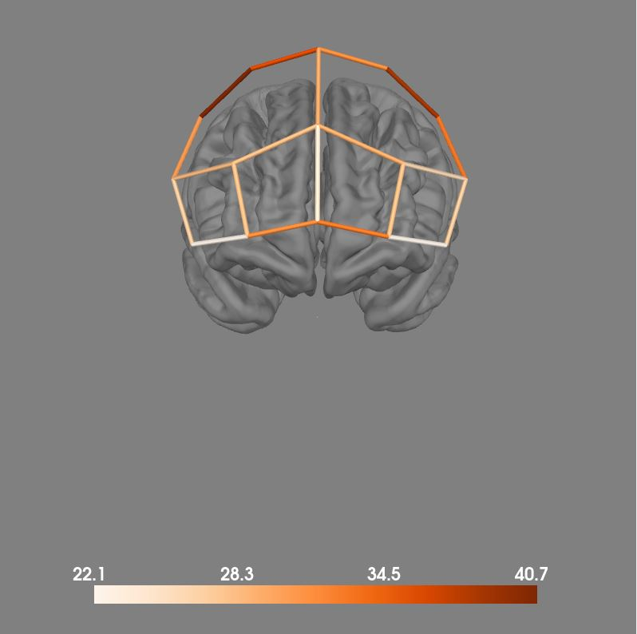

```{r setup, include=FALSE}
knitr::opts_chunk$set(echo = TRUE)
knitr::opts_chunk$set(fig.width=10, fig.height=5) 

# load library
library(jtools)
library(dplyr)
library(plyr, include.only = c("revalue"))
library(tidyr)
library(purrr)
library(stringr)
library(forcats)
library(arsenal)

library(gt)
library(gtsummary)

```

# Introduction

This document is intended to be used as an "open lab notebook" for an exploratory, data-driven fNIRS study on navigated walking, analyzing an existing dataset, the Park-MOVE dataset collected between 2021 and 2023 [@franzen2023]. Note that while the data is in a central repository, access to the data is restricted and regulated by data transfer agreements.

The document is built from the project's GitHub repository where all code is also contained: <https://github.com/alkvi/fnirs_navigation_study>

How the dataset used in this study was prepared can be found in: <https://github.com/alkvi/fnirs_dataset_preparation>

## How has the data already been used?

We have a pilot study (<https://doi.org/10.1002/brb3.2948>) where we analysed the first 10 participants and looked at some condition effects. We have a validation study (<https://doi.org/10.1016/j.nicl.2024.103637>) where we looked at condition effects (single-task and dual—task walking) as well as a number of interaction effects. We have a hypothesis-driven study (<https://doi.org/10.1186/s12984-025-01864-w>) where we evaluated gait automaticity relationships to prefrontal activity during single-task and dual-task walking. This is the first study evaluating navigated walking in the full dataset. 

# Methods

The idea of the study is as follows:

- Use clustering on behavioral variables to find patterns of performance
- Evaluate demographics and clinical variables in and between clusters
- Evaluate neuroimaging data in clusters and contrast between clusters

## Hierachical clustering

Clustering was performed on performance data: gait variables, turning variables, task accuracy, task response time. Hierarchical clustering on distance matrices generated via unsupervised Random Forest was used. Imputation before clustering was also done. Number of clusters determined via majority voting through the NbClust package. Feature importance via supervised random forest on inferred cluster labels.

For details, see: (LINK)

## fNIRS analysis

System used is an 8x8 NIRSport2, with a montage over the prefrontal cortex. Sampling rate 10 Hz.

The fNIRS analysis is a fairly straightforward GLM analysis in the MATLAB NIRS AnalyzIR toolbox [@santosa2018].

Differential path-length factor (DPF) is set to depend on age [@scholkmann2013b]. HbO2 and HbR are combined by calculating the correlation-based signal improvement (CBSI) [@cui2010] signal. Channels are filtered based on a combined criteria of scalp coupling index (SCI) and peak spectral power (PSP) [@hernandez2020], with a bad channel detected as SCI < 0.7 or PSP < 0.1.

Subject level analysis is done with GLM + pre-whitening and autoregression (AR-IRLS) [@barker2013], with short-separation regressors.

Group level analyses is done with mixed effects models with subject as random intercept.

For details, see: (LINK)

# Results 

## Signal quality

The combined criteria on SCI and PSP marks a substantial amount of channels as bad.

From 20-30% of participants who had channels below criteria in the lower channels (around BA46), to up to 40% in the higher channels (around BA9).



## Cluster demographics and performance

```{r}

# Load behavioral data
source("../scripts/performance_data.R")
source("../scripts/subject_data.R")

performance_data <- load_subject_performance_data()
subject_data <- load_subject_data()

# Fix outlier in gait variables - two unreasonable values for step time var (>100)
idx <- which.max(performance_data$step_time_variability_protocol2_ST_walk)
performance_data$step_time_variability_protocol2_ST_walk[idx] <- NA
idx <- which.max(performance_data$step_time_variability_protocol2_ST_walk)
performance_data$step_time_variability_protocol2_ST_walk[idx] <- NA

# Also in navigation performance, two people who did not understand task
idx <- which.max(performance_data$acc_s3_wrong_st)
performance_data$acc_s3_wrong_st[idx] <- NA
idx <- which.max(performance_data$acc_s3_wrong_dt)
performance_data$acc_s3_wrong_dt[idx] <- NA
idx <- which.max(performance_data$acc_s3_wrong_tot)
performance_data$acc_s3_wrong_tot[idx] <- NA
idx <- which.max(performance_data$acc_s3_wrong_st)
performance_data$acc_s3_wrong_st[idx] <- NA
idx <- which.max(performance_data$acc_s3_wrong_dt)
performance_data$acc_s3_wrong_dt[idx] <- NA
idx <- which.max(performance_data$acc_s3_wrong_tot)
performance_data$acc_s3_wrong_tot[idx] <- NA

# Load cluster results
# Keep in mind cluster 1 = low performance for the OA group 
# but cluster 1 = high performance for the PD group
cluster_oa <- read.csv("../data/clusters_oa.csv") 
cluster_oa <- cluster_oa %>%
  mutate(cluster = case_when(
    cluster == 1 ~ "low performing",
    cluster == 2 ~ "high performing"
  ))

cluster_pd <- read.csv("../data/clusters_pd.csv") 
cluster_pd <- cluster_pd %>%
  mutate(cluster = case_when(
    cluster == 1 ~ "high performing",
    cluster == 2 ~ "low performing"
  ))

clusters <- bind_rows(cluster_oa, cluster_pd)

# Assign cluster function
performance_data <- performance_data %>% left_join(clusters %>% select(subject, cluster), by = "subject")
subject_data <- subject_data %>% left_join(clusters %>% select(subject, cluster), by = "subject")

# Separate out YA
performance_data <- performance_data %>% filter(group != "YA")
subject_data <- subject_data %>% filter(group != "YA")

performance_data$group <- droplevels(performance_data$group)
subject_data$group <- droplevels(subject_data$group)

# Separate data by groups to create tables per group
performance_data_oa <- performance_data %>% filter(group == "OA")
subject_data_oa <- subject_data %>% filter(group == "OA")
performance_data_pd <- performance_data %>% filter(group == "PD")
subject_data_pd <- subject_data %>% filter(group == "PD")

```

## Baseline performance 

```{r}
#| warning: false

# Compare baseline demographics and performance.

tab1_demo <-
  tbl_summary(
    subject_data,
    include = c(sex, age, crf_utbildning_ar, weight, height, frandin_grimby.x, ramlat_12_man,
                mb_total, g12_sum, tmt_2, tmt_4, tmt_4_tmt_2_contrast, cwit_3, ravlt_ret, vf_sum),
    by = group,
    missing = "no",
    type = list(frandin_grimby.x ~ "continuous"),
    digits = list(crf_utbildning_ar ~ 0, frandin_grimby.x ~ 0),
  ) |> 
  add_ci() |>
  add_p() |>
  add_q() |>
  bold_p(t = 0.05, q=TRUE) |>
  modify_header(
    label ~ "**Variable**",
  )

tab1_demo

# We want to compare the performance variables we use for clustering.
# Some values are missing, so calculate how many and append to table.
# These are the ones that are imputed in the clustering.

tab1_performance <-
  tbl_summary(
    performance_data,
    include = c(
      mean_walking_speed_protocol2_ST_walk,
      mean_walking_speed_protocol2_ST_navigation,
      mean_stride_length_protocol2_ST_walk,
      mean_stride_length_protocol2_ST_navigation,
      mean_cadence_protocol2_ST_walk,
      mean_cadence_protocol2_ST_navigation,
      step_time_variability_protocol2_ST_walk,
      step_time_variability_protocol2_ST_navigation,
      turns_velocity_protocol_2,
      nav_s2_hesitation,
      nav_s2_wrong,
      mean_walking_speed_protocol3_ST_navigation,
      mean_walking_speed_protocol3_DT_navigation,
      mean_stride_length_protocol3_ST_navigation,
      mean_stride_length_protocol3_DT_navigation,
      mean_cadence_protocol3_ST_navigation,
      mean_cadence_protocol3_DT_navigation,
      step_time_variability_protocol3_ST_navigation,
      step_time_variability_protocol3_DT_navigation,
      dt_cost_walk_speed_protocol3,
      dt_cost_stride_length_protocol3,
      dt_cost_step_time_variability_protocol3,
      turns_velocity_protocol_3,
      acc_s3_hesitation_tot,
      acc_s3_wrong_tot,
      DT_protocol_3_stroop_acc,
      DT_protocol_3_stroop_time),
    by = group,
    missing = "no",
    type = list(c(nav_s2_hesitation, nav_s2_wrong, acc_s3_hesitation_tot, acc_s3_wrong_tot) ~ "continuous")
  ) |> 
  add_p() |>
  add_q() |>
  bold_p(t = 0.05, q=TRUE) |>
  add_n(
    statistic = "{p_miss}",
    col_label = "**Missing n (%)**",
  )

tab1_performance 

```

## Cluster demographics

```{r}
#| warning: false

# Create tables
# This will warn about ties so we get approximate p values
tab1_oa <-
  tbl_summary(
    subject_data_oa,
    include = c(sex, age, crf_utbildning_ar, weight, height, frandin_grimby.x, ramlat_12_man),
    by = cluster,
    missing = "no",
    type = list(frandin_grimby.x ~ "continuous"),
    digits = list(crf_utbildning_ar ~ 0, frandin_grimby.x ~ 0)
  ) |> 
  add_p() |>
  bold_p(t = 0.05) |>
  modify_header(label = "**Variable**")

tab1_pd <-
  tbl_summary(
    subject_data_pd,
    include = c(sex, age, crf_utbildning_ar, weight, height, frandin_grimby.x, ramlat_12_man),
    by = cluster,
    missing = "no",
    type = list(frandin_grimby.x ~ "continuous"),
    digits = list(crf_utbildning_ar ~ 0, frandin_grimby.x ~ 0)
  ) |> 
  add_p() |>
  bold_p(t = 0.05) |>
  modify_header(label = "**Variable**")
  
tab1 <- tbl_merge(
  tbls = list(tab1_oa, tab1_pd),
  tab_spanner = c("**OA**", "**PD**")
) |>
  modify_caption("**Table 1. Demographics**")


tab2_oa <-
  tbl_summary(
    subject_data_oa,
    include = c(mb_total, g12_sum, tmt_2, tmt_4, tmt_4_tmt_2_contrast, cwit_3, ravlt_ret, vf_sum),
    by = cluster,
    missing = "no",
    type = list(c(mb_total, g12_sum) ~ "continuous"),
  ) |> 
  add_p() |>
  bold_p(t = 0.05) |>
  modify_header(label = "**Variable**")

tab2_pd <-
  tbl_summary(
    subject_data_pd,
    include = c(mb_total, g12_sum, tmt_2, tmt_4, tmt_4_tmt_2_contrast, cwit_3, ravlt_ret, vf_sum),
    by = cluster,
    missing = "no",
    type = list(c(mb_total, g12_sum) ~ "continuous"),
  ) |> 
  add_p() |>
  bold_p(t = 0.05) |>
  modify_header(label = "**Variable**")
  
tab2 <- tbl_merge(
  tbls = list(tab2_oa, tab2_pd),
  tab_spanner = c("**OA**", "**PD**")
) |>
  modify_caption("**Table 2. Clinical & neuropsychological**")

tab3_oa <-
  tbl_summary(
    performance_data_oa,
    include = c(
      mean_walking_speed_protocol2_ST_walk,
      mean_walking_speed_protocol2_ST_navigation,
      mean_stride_length_protocol2_ST_walk,
      mean_stride_length_protocol2_ST_navigation,
      mean_cadence_protocol2_ST_walk,
      mean_cadence_protocol2_ST_navigation,
      step_time_variability_protocol2_ST_walk,
      step_time_variability_protocol2_ST_navigation,
      turns_velocity_protocol_2,
      nav_s2_hesitation,
      nav_s2_wrong
      ),
    by = cluster,
    missing = "no",
    type = list(c(nav_s2_hesitation, nav_s2_wrong) ~ "continuous"),
  ) |> 
  add_p() |>
  bold_p(t = 0.05) |>
  modify_header(label = "**Variable**")

tab3_pd <-
  tbl_summary(
    performance_data_pd,
    include = c(
      mean_walking_speed_protocol2_ST_walk,
      mean_walking_speed_protocol2_ST_navigation,
      mean_stride_length_protocol2_ST_walk,
      mean_stride_length_protocol2_ST_navigation,
      mean_cadence_protocol2_ST_walk,
      mean_cadence_protocol2_ST_navigation,
      step_time_variability_protocol2_ST_walk,
      step_time_variability_protocol2_ST_navigation,
      turns_velocity_protocol_2,
      nav_s2_hesitation,
      nav_s2_wrong
      ),
    by = cluster,
    missing = "no",
    type = list(c(nav_s2_hesitation, nav_s2_wrong) ~ "continuous"),
  ) |> 
  add_p() |>
  bold_p(t = 0.05) |>
  modify_header(label = "**Variable**")
  
tab3 <- tbl_merge(
  tbls = list(tab3_oa, tab3_pd),
  tab_spanner = c("**OA**", "**PD**")
) |>
  modify_caption("**Table 3. Performance variables, protocol 2**")

tab4_oa <-
  tbl_summary(
    performance_data_oa,
    include = c(
      mean_walking_speed_protocol3_ST_navigation,
      mean_walking_speed_protocol3_DT_navigation,
      mean_stride_length_protocol3_ST_navigation,
      mean_stride_length_protocol3_DT_navigation,
      mean_cadence_protocol3_ST_navigation,
      mean_cadence_protocol3_DT_navigation,
      step_time_variability_protocol3_ST_navigation,
      step_time_variability_protocol3_DT_navigation,
      dt_cost_walk_speed_protocol3,
      dt_cost_stride_length_protocol3,
      dt_cost_step_time_variability_protocol3,
      turns_velocity_protocol_3,
      acc_s3_hesitation_tot,
      acc_s3_wrong_tot,
      DT_protocol_3_stroop_acc,
      DT_protocol_3_stroop_time
      ),
    by = cluster,
    missing = "no",
    type = list(c(acc_s3_hesitation_tot, 
                  acc_s3_wrong_tot,
                  DT_protocol_3_stroop_acc, 
                  DT_protocol_3_stroop_time) ~ "continuous"),
  ) |> 
  add_p() |>
  bold_p(t = 0.05) |>
  modify_header(label = "**Variable**")

tab4_pd <-
  tbl_summary(
    performance_data_pd,
    include = c(
      mean_walking_speed_protocol3_ST_navigation,
      mean_walking_speed_protocol3_DT_navigation,
      mean_stride_length_protocol3_ST_navigation,
      mean_stride_length_protocol3_DT_navigation,
      mean_cadence_protocol3_ST_navigation,
      mean_cadence_protocol3_DT_navigation,
      step_time_variability_protocol3_ST_navigation,
      step_time_variability_protocol3_DT_navigation,
      dt_cost_walk_speed_protocol3,
      dt_cost_stride_length_protocol3,
      dt_cost_step_time_variability_protocol3,
      turns_velocity_protocol_3,
      acc_s3_hesitation_tot,
      acc_s3_wrong_tot,
      DT_protocol_3_stroop_acc,
      DT_protocol_3_stroop_time
      ),
    by = cluster,
    missing = "no",
    type = list(c(acc_s3_hesitation_tot, 
                  acc_s3_wrong_tot,
                  DT_protocol_3_stroop_acc, 
                  DT_protocol_3_stroop_time) ~ "continuous"),
  ) |> 
  add_p() |>
  bold_p(t = 0.05) |>
  modify_header(label = "**Variable**")
  
tab4 <- tbl_merge(
  tbls = list(tab4_oa, tab4_pd),
  tab_spanner = c("**OA**", "**PD**")
) |>
  modify_caption("**Table 4. Performance variables, protocol 3**")

# Display the tables in the next block

```

```{r, results='asis'}

tab1
tab2
tab3
tab4

```

## Neuroimaging results

The high performing cluster in the OA group had an increase in activity in BA46 compared to rest during navigation in protocol 2. The low performing cluster did not have any significant increase of activity in BA46.

In the PD group, both clusters had an increase in dlPFC activity during navigation compared to rest in protocol 2, but only the high performing cluster had an increase in dlPFC activity during single- and dual-task navigation during protocol 3.

```{r, results='asis'}

format_results_table <- function(data) {
  data %>%
    gt() %>%
    fmt_number(
      columns = everything(),
      decimals = 2
    ) %>%
    fmt_number(
      columns = c(DF),
      decimals = 0
    ) %>%
    fmt(
      columns = c(p, FDR_p),
      fns = function(x) {
        ifelse(x < 0.001, "<.001", sprintf("%.3f", x))
      }
    ) %>%
    tab_style(
      style = cell_text(weight = "bold"),
      locations = cells_body(
        rows = FDR_p < 0.05
      )
    )
}

# Structure the results. Keep in mind cluster 1 = low performance
# for the OA group but cluster 1 = high performance for the PD group
# We will also FDR-adjust p values per protocol here
results_protocol_2 <- read.csv("../data/results_protocol_2.csv")
results_protocol_2 <- results_protocol_2 %>%
  filter(ROI == "BA46") %>%
  select(-AIC, -BIC, -formula, -type, -q) %>%
  rename(Condition = Contrast) %>%
  mutate(
    Condition = if_else(
      group == "PD",
      str_replace_all(
        Condition,
        c(
          "cond_" = "",
          "Navigated_walking" = "Navigation",
          "Straight_walking" = "Straight walking",
          ":cluster_1" = " (high performing)",
          ":cluster_2" = " (low performing)"
        )
      ),
      str_replace_all(
        Condition,
        c(
          "cond_" = "",
          "Navigated_walking" = "Navigation",
          "Straight_walking" = "Straight walking",
          ":cluster_1" = " (low performing)",
          ":cluster_2" = " (high performing)"
        )
      )
    ),
    FDR_p = p.adjust(p, method = "BH")
  ) %>%
  select(group, everything())


results_protocol_3 = read.csv("../data/results_protocol_3.csv")
results_protocol_3 <- results_protocol_3 %>%
  filter(ROI == "BA46") %>%
  select(-AIC, -BIC, -formula, -type, -q) %>%
  rename(Condition = Contrast) %>%
  mutate(
    Condition = if_else(
      group == "PD",
      str_replace_all(
        Condition,
        c(
          "cond_Navigation_and_Aud_Stroop" = "Navigation DT",
          "cond_Navigation" = "Navigation ST",
          ":cluster_1" = " (high performing)",
          ":cluster_2" = " (low performing)"
        )
      ),
      str_replace_all(
        Condition,
        c(
          "cond_Navigation_and_Aud_Stroop" = "Navigation DT",
          "cond_Navigation" = "Navigation ST",
          ":cluster_1" = " (low performing)",
          ":cluster_2" = " (high performing)"
        )
      )
    ),
    FDR_p = p.adjust(p, method = "BH")
  ) %>%
  select(group, everything())


```

### Protocol 2 ROI


```{r, results='asis'}

format_results_table(results_protocol_2)

```


### Protocol 2 OA

::: {layout-nrow=2 layout-ncol="3"}


:::

### Protocol 2 PD

::: {layout-nrow=2 layout-ncol="3"}


:::

### Protocol 3 ROI


```{r, results='asis'}

format_results_table(results_protocol_3)

```


### Protocol 3 OA

::: {layout-nrow=2 layout-ncol="3"}


:::


### Protocol 3 PD

::: {layout-nrow=2 layout-ncol="3"}


:::

# Disease severity

```{r}
#| warning: false


updrs_file <- paste("../../Park-MOVE_fnirs_dataset_v2/REDcap_data/UPDRS_data.csv", sep="")
measurement_date_file <- paste("../../Park-MOVE_fnirs_dataset_v2/measurement_dates.csv", sep="")

updrs_data <- read.csv(updrs_file)
updrs_data$updrs_3_total <- rowSums(updrs_data[, 35:66], na.rm = TRUE)
updrs_data <- updrs_data[c("id_nummer", "updrs_3_total")]
names(updrs_data)[names(updrs_data) == 'id_nummer'] <- 'subject'

# Get disease duration via diagnosis date and measurement date
diagnosis_data <- subject_data_pd[c("subject", "crf_pd_year_phone")]
measurement_dates <- read.csv(measurement_date_file, sep=";")
measurement_dates$measurement_date_t1 <- as.Date(measurement_dates$measurement_date_t1, format = "%Y-%m-%d")
measurement_dates$year <- format(measurement_dates$measurement_date_t1, "%Y")
measurement_dates <- measurement_dates[c("subject", "year")]
measurement_dates <- merge(diagnosis_data, measurement_dates, by = "subject", all = TRUE)
measurement_dates$disease_dur <- as.numeric(measurement_dates$year) - as.numeric(measurement_dates$crf_pd_year_phone)
measurement_dates <- measurement_dates[c("subject", "disease_dur")]

# Add measurment dates
subject_data_pd <- merge(subject_data_pd, measurement_dates, by = "subject", all = FALSE)
subject_data_pd <- merge(subject_data_pd, updrs_data, by = "subject", all = FALSE)

tab5_pd <-
  tbl_summary(
    subject_data_pd,
    include = c(
      led_total,
      updrs_3_total,
      disease_dur,
      ),
    by = cluster,
    missing = "no",
    type = list(c(disease_dur, 
                  updrs_3_total) ~ "continuous"),
  ) |> 
  add_p() |>
  bold_p(t = 0.05) |>
  modify_header(label = "**Variable**")

tab5_pd

```


# Manuscript

Finished manuscript will be linked here when ready.

# References
