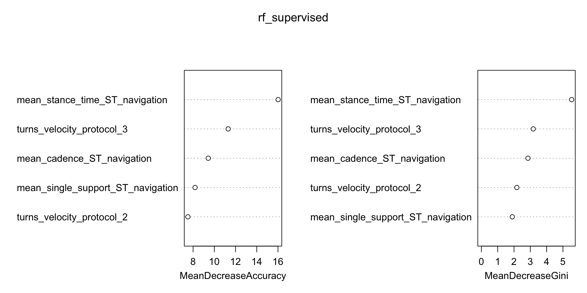
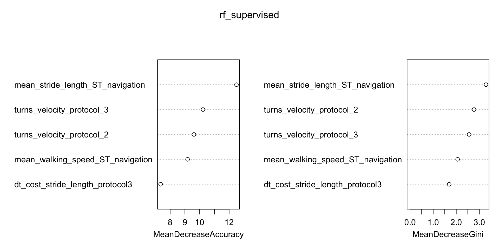

| Variable | OA (N = 48)1 | PD (N = 42)1 | p-value2 |
|----------|-------------------------|-------------------------|---------------------|
| Mini-BESTest score | 26 (24, 27) | 24 (22, 25) | <0.001 |
| Walk-12 sum | 0 (0, 3) | 6 (3, 11) | <0.001 |
| TMT2, s | 32 (26, 44) | 44 (34, 66) | <0.001 |
| TMT4, s | 75 (56, 96) | 86 (71, 134) | 0.013 |
| TMT4 - TMT2, s | 42 (28, 60) | 49 (30, 75) | 0.3 |
| CWIT3, s | 59 (50, 69) | 62 (52, 68) | 0.5 |
| RAVLT retention, words | 12 (9, 13) | 9 (6, 11) | 0.002 |
| Verbal fluency, total words | 51 (42, 60) | 49 (41, 59) | 0.4 |
| LEDD, mg | N/A | 413 (400, 500) |  |
| MDS-UPDRS III | N/A | 26 (18, 32) |  |
| Disease duration, yrs | N/A | 4 (3, 6) |  |
| Hoehn & Yahr stage (counts)* | N/A | I: 2, II: 21, III:  16, IV: 1 |  |
: Clinical & neuropsychological variables. Abbreviations: OA older adults, PD Parkinson's disease. ^1^Median (Q1, Q3). ^2^Wilcoxon rank sum test; Wilcoxon rank sum exact test. *missing n=2 {#tbl:clinical_overall} 

| Variable | OA High Performing (N = 35)1 | OA Low Performing (N = 13)1 | p-value2 | q-value3 | PD High Performing (N = 26)1 | PD Low Performing (N = 16)1 | p-value2 | q-value3 |
|----------|----------:|----------:|----------:|----------:|----------:|----------:|----------:|----------:|
| Walking speed (straight), m/s | 1.31 (1.26, 1.35) | 1.11 (1.00, 1.21) | <0.001 | <0.001 | 1.20 (1.14, 1.33) | 1.06 (0.75, 1.15) | <0.001 | <0.001 |
| Walking speed (navigation), m/s | 1.03 (0.93, 1.09) | 0.88 (0.68, 0.93) | <0.001 | <0.001 | 0.90 (0.82, 0.98) | 0.71 (0.53, 0.80) | <0.001 | <0.001 |
| Stride length (straight), m | 1.38 (1.26, 1.48) | 1.33 (1.23, 1.44) | 0.4 | 0.4 | 1.35 (1.25, 1.42) | 1.11 (0.92, 1.25) | <0.001 | <0.001 |
| Stride length (navigation), m | 1.09 (1.06, 1.22) | 1.11 (0.97, 1.16) | 0.3 | 0.3 | 1.04 (0.99, 1.13) | 0.79 (0.60, 0.86) | <0.001 | <0.001 |
| Stance time (straight), s | 0.68 (0.62, 0.72) | 0.77 (0.75, 0.84) | <0.001 | <0.001 | 0.70 (0.65, 0.75) | 0.70 (0.66, 0.76) | 0.5 | 0.7 |
| Stance time (navigation), s | 0.70 (0.65, 0.74) | 0.83 (0.79, 0.86) | <0.001 | <0.001 | 0.72 (0.70, 0.79) | 0.74 (0.69, 0.79) | 0.8 | >0.9 |
| Single support (straight), s | 0.39 (0.37, 0.40) | 0.42 (0.41, 0.44) | <0.001 | <0.001 | 0.407 (0.397, 0.419) | 0.387 (0.368, 0.404) | 0.014 | 0.030 |
| Single support (navigation), s | 0.402 (0.384, 0.418) | 0.445 (0.441, 0.463) | <0.001 | <0.001 | 0.42 (0.40, 0.44) | 0.39 (0.34, 0.40) | 0.003 | 0.009 |
| Cadence (straight), steps/min | 114 (108, 119) | 101 (95, 103) | <0.001 | <0.001 | 108 (103, 115) | 111 (104, 115) | 0.6 | 0.8 |
| Cadence (navigation), steps/min | 107 (104, 113) | 95 (91, 98) | <0.001 | <0.001 | 105 (98, 115) | 106 (103, 115) | 0.3 | 0.6 |
| Step time variability (straight), ms | 14 (11, 19) | 18 (15, 27) | 0.013 | 0.020 | 16 (12, 20) | 21 (16, 35) | 0.033 | 0.063 |
| Step time variability (navigation), ms | 46 (29, 61) | 62 (43, 71) | 0.10 | 0.14 | 56 (45, 88) | 59 (49, 87) | 0.7 | 0.9 |
| Turn velocity (peak), deg/s | 144 (130, 153) | 112 (103, 123) | <0.001 | <0.001 | 128 (114, 138) | 100 (84, 106) | <0.001 | <0.001 |
| Hesitations (navigation) | 1 (0, 3) | 1 (0, 3) | 0.5 | 0.5 | 1 (0, 2) | 1 (0, 3) | >0.9 | >0.9 |
| Mistakes (navigation) | 1 (0, 2) | 0 (0, 3) | 0.7 | 0.7 | 0 (0, 1) | 0 (0, 2) | >0.9 | >0.9 |
: Performance variables, protocol 2. Abbreviations: OA older adults, PD Parkinson's disease. ^1^Median (Q1, Q3). ^2^Wilcoxon rank sum exact test; Wilcoxon rank sum test. ^3^False discovery rate correction for multiple testing. {#tbl:perf_protocol_2_cluster} 

| Variable | OA High Performing (N = 35)1 | OA Low Performing (N = 13)1 | p-value2 | q-value3 | PD High Performing (N = 26)1 | PD Low Performing (N = 16)1 | p-value2 | q-value3 |
|----------|----------:|----------:|----------:|----------:|----------:|----------:|----------:|----------:|
| Walking speed (ST), m/s | 1.05 (0.99, 1.12) | 0.90 (0.79, 0.98) | <0.001 | <0.001 | 0.95 (0.90, 1.09) | 0.79 (0.71, 0.86) | <0.001 | <0.001 |
| Stride length (ST), m | 1.13 (1.05, 1.22) | 1.12 (1.01, 1.16) | 0.4 | 0.6 | 1.09 (1.02, 1.18) | 0.86 (0.81, 0.90) | <0.001 | <0.001 |
| Cadence (ST), steps/min | 113 (106, 118) | 97 (95, 101) | <0.001 | <0.001 | 107 (98, 115) | 107 (106, 116) | 0.5 | 0.7 |
| Step time variability (ST), ms | 42 (29, 48) | 48 (33, 71) | 0.3 | 0.6 | 41 (34, 65) | 47 (42, 62) | 0.2 | 0.3 |
| Stance time (ST), s | 0.68 (0.63, 0.73) | 0.78 (0.77, 0.81) | <0.001 | <0.001 | 0.71 (0.66, 0.78) | 0.73 (0.68, 0.77) | 0.6 | 0.7 |
| Single support (ST), s | 0.395 (0.381, 0.412) | 0.436 (0.423, 0.456) | <0.001 | <0.001 | 0.41 (0.39, 0.43) | 0.40 (0.38, 0.40) | 0.045 | 0.086 |
| DT cost walking speed, % | 1.9 (-0.7, 5.6) | 4.1 (0.2, 5.5) | 0.4 | 0.6 | 3.1 (-1.1, 5.2) | 6.5 (5.0, 10.9) | <0.001 | 0.003 |
| DT cost stride length, % | 2.2 (0.4, 3.9) | 3.9 (1.0, 4.9) | 0.3 | 0.6 | 3.2 (0.5, 5.6) | 6.9 (5.3, 11.4) | <0.001 | 0.002 |
| DT cost cadence, % | -0.7 (-3.4, 0.7) | -0.2 (-4.2, 2.3) | 0.5 | 0.7 | -2.2 (-5.2, -0.5) | 1.3 (-1.4, 3.0) | 0.007 | 0.020 |
| DT cost step time variability, % | 11 (-19, 44) | 14 (-27, 47) | 0.8 | 0.9 | 27 (-7, 49) | 7 (-14, 18) | 0.061 | 0.10 |
| DT cost stance time, % | -0.33 (-1.97, 0.63) | 0.14 (-2.49, 1.56) | 0.7 | 0.9 | -0.6 (-3.0, 1.0) | 2.2 (-0.2, 4.2) | 0.016 | 0.038 |
| DT cost single support, % | 1.06 (-0.72, 2.79) | 1.45 (-0.24, 3.65) | 0.6 | 0.7 | 2.4 (0.7, 3.5) | 2.3 (0.1, 5.2) | 0.7 | 0.7 |
| Turn velocity (peak), deg/s | 143 (132, 154) | 116 (102, 119) | <0.001 | <0.001 | 128 (108, 148) | 100 (89, 103) | <0.001 | <0.001 |
| Hesitations (ST) | 0 (0, 1) | 0 (0, 1) | 0.5 | 0.7 | 0 (0, 1) | 0 (0, 1) | 0.7 | 0.7 |
| Hesitations (DT) | 0 (0, 2) | 1 (0, 3) | 0.8 | 0.9 | 0 (0, 1) | 1 (0, 2) | 0.065 | 0.10 |
| Mistakes (ST) | 0 (0, 0) | 0 (0, 0) | 0.4 | 0.6 | 0 (0, 0) | 0 (0, 2) | 0.082 | 0.12 |
| Mistakes (DT) | 0 (0, 0) | 0 (0, 0) | 0.3 | 0.6 | 0 (0, 1) | 1 (0, 2) | 0.027 | 0.058 |
| Accuracy (DT), % | 100.0 (95.2, 100.0) | 100.0 (97.6, 100.0) | 0.9 | 0.9 | 100 (95, 100) | 92 (74, 98) | 0.006 | 0.018 |
| Answer time (DT), s | 1.11 (0.98, 1.27) | 1.20 (1.07, 1.41) | 0.14 | 0.4 | 1.16 (1.03, 1.30) | 1.20 (1.06, 1.30) | 0.8 | 0.8 |
: Performance variables, protocol 3. Abbreviations: OA older adults, PD Parkinson's disease. ^1^Median (Q1, Q3). ^2^Wilcoxon rank sum exact test; Wilcoxon rank sum test. ^3^False discovery rate correction for multiple testing. {#tbl:perf_protocol_3_cluster} 

| Group | Condition                    | Beta  | SE   | DF  | t     | FDR p |
| ----- | ---------------------------- | ----- | ---- | --- | ----- | ----- |
| OA    | Navigation (high - low)      | -0.55 | 1.01 | 92  | -0.54 | 0.826 |
| PD    | Navigation (high - low)      | 0.11  | 0.76 | 78  | 0.15  | 0.882 |
| OA    | Straight walking (high -low) | -0.65 | 0.95 | 92  | -0.69 | 0.826 |
| PD    | Straight walking (high -low) | -0.35 | 0.70 | 78  | -0.50 | 0.826 |
: fNIRS ROI contrast results, protocol 2. Abbreviations: OA, older adults; PD, Parkinson's disease; SE, standard error; DF, degrees of freedom; FDR, false discovery rate; ROI, region of interest. {#tbl:roi_protocol_2_contrast} 

| Group | Condition                  | Beta | SE   | DF  | t    | FDR p |
| ----- | -------------------------- | ---- | ---- | --- | ---- | ----- |
| OA    | Navigation ST (high - low) | 0.88 | 1.02 | 90  | 0.87 | 0.581 |
| PD    | Navigation ST (high - low) | 0.55 | 0.80 | 74  | 0.69 | 0.581 |
| OA    | Navigation DT (high - low) | 1.14 | 0.99 | 90  | 1.15 | 0.581 |
| PD    | Navigation DT (high - low) | 0.43 | 0.77 | 74  | 0.55 | 0.581 |
: fNIRS ROI contrast results, protocol 3. Abbreviations: OA, older adults; PD, Parkinson's disease; SE, standard error; DF, degrees of freedom; FDR, false discovery rate; ROI, region of interest. {#tbl:roi_protocol_3_contrast} 

{#fig:varimp_oa}

{#fig:varimp_pd}
